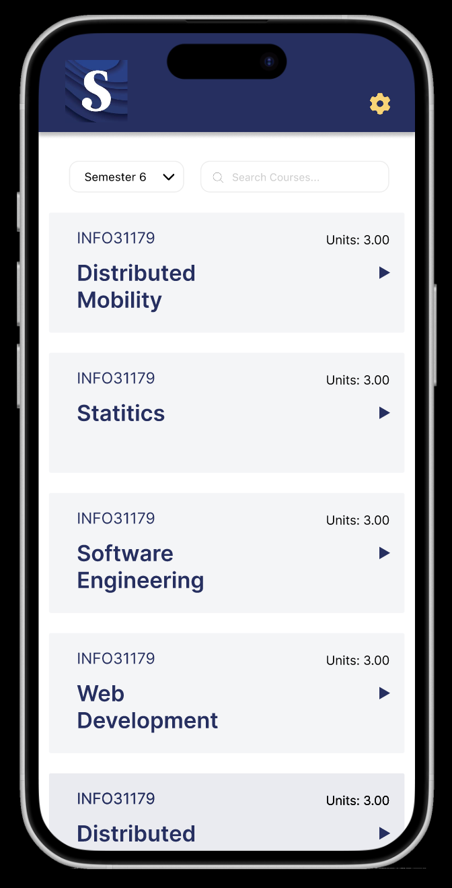
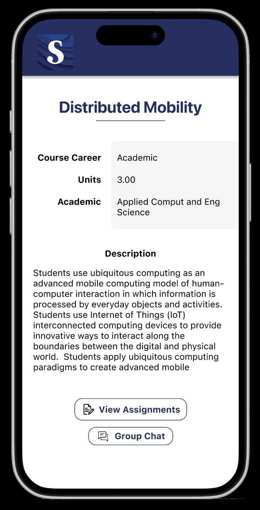
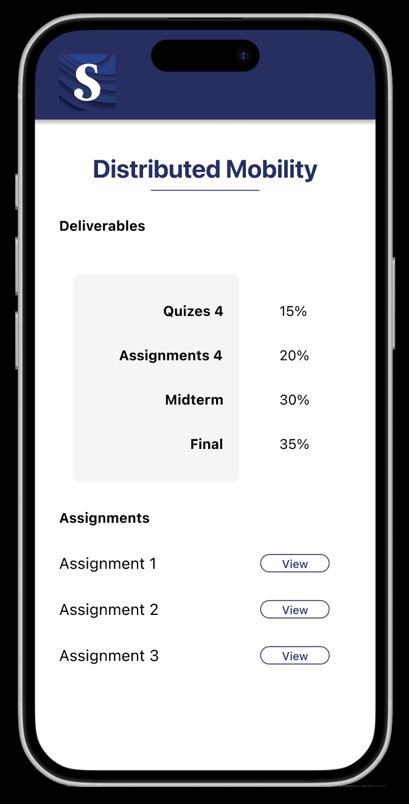
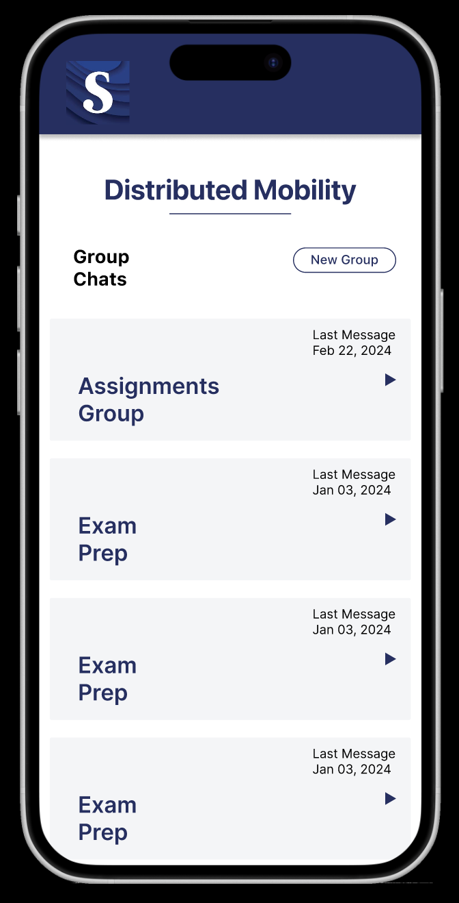
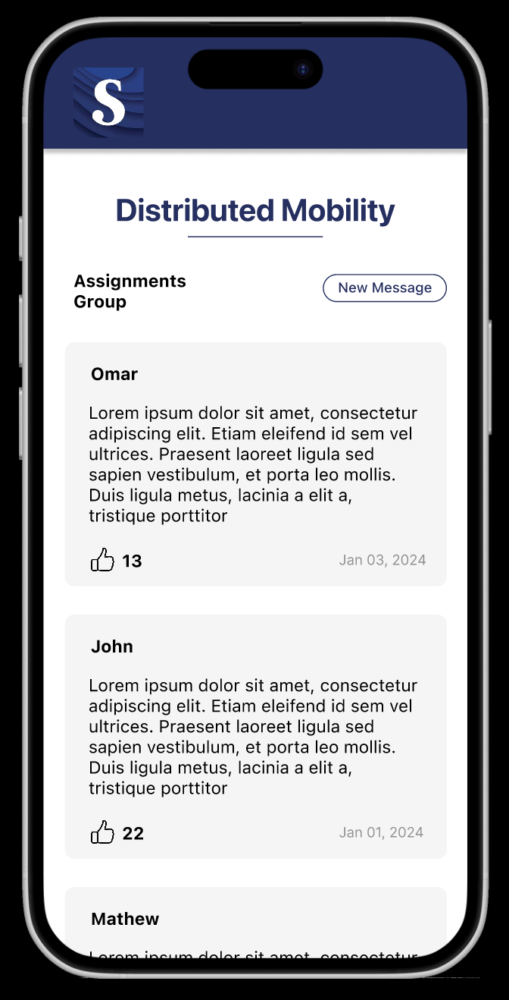
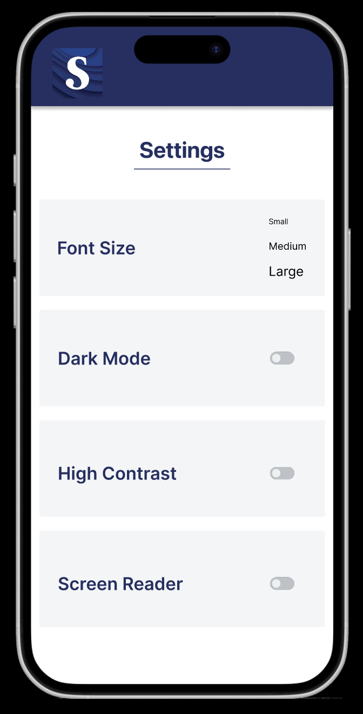

# HCI_A2
Human Computer Interaction Assignment

# Description
This is an app prototype that allows the user to manage their courses, assignments and communication. The app features a course list with search and filters and a detailed course page with deliverables worth. The assignment page allows the user to read the assignment description and see attached files, add files to submit, add text, and submit the assignment. The settings page has multiple accessibility options: font size, dark mode, high contrast, and screen reader.

# Screenshots

